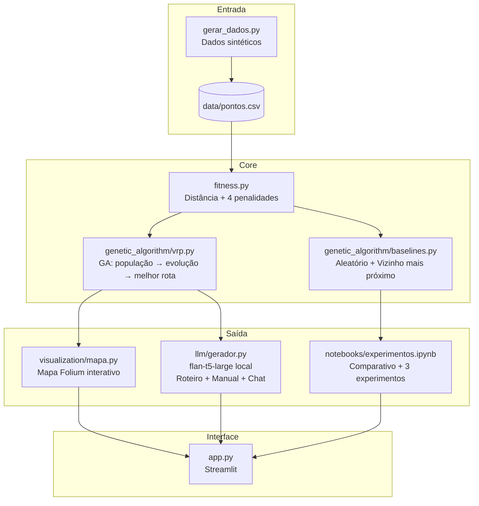
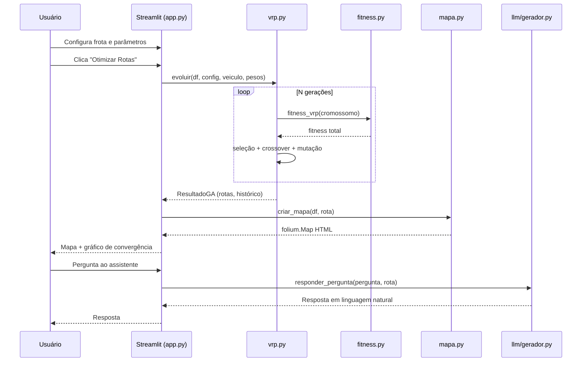
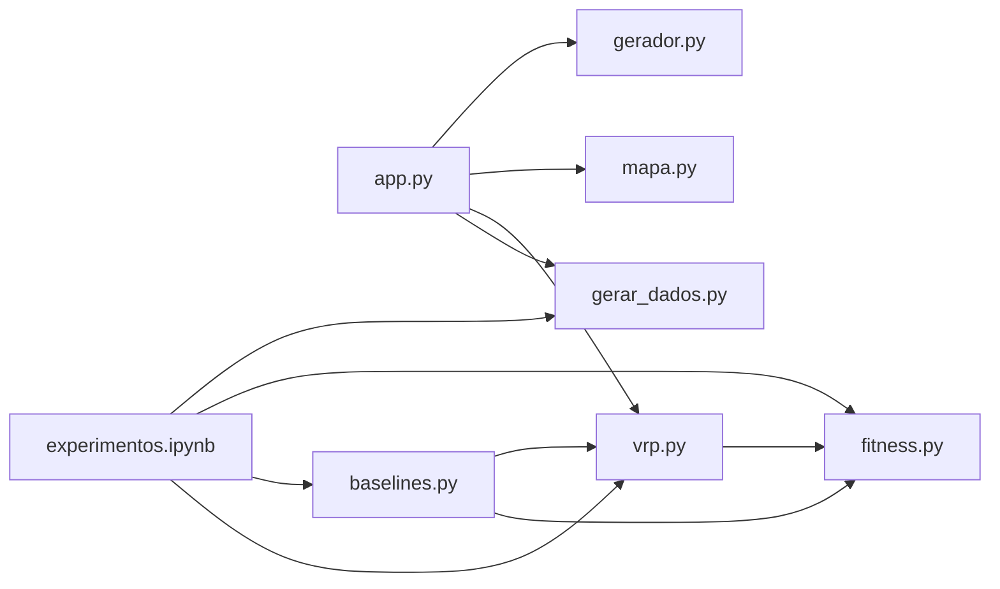

# Diagrama de Arquitetura — VRP Médico

## Visão geral dos componentes

---

## Fluxo de dados

---

## Estrutura de módulos

---

## Componentes e responsabilidades

| Módulo | Responsabilidade | Tecnologia |
|---|---|---|
| `gerar_dados.py` | Geração de pontos sintéticos reprodutíveis | NumPy, Pandas |
| `fitness.py` | Avaliação de qualidade de rotas (5 componentes) | Python puro |
| `genetic_algorithm/vrp.py` | Algoritmo Genético completo (TSP → VRP) | Python puro |
| `genetic_algorithm/baselines.py` | Baselines para comparação (aleatório, greedy) | Python puro |
| `visualization/mapa.py` | Renderização de rotas em mapa interativo | Folium (Leaflet.js) |
| `llm/gerador.py` | Geração de linguagem natural a partir das rotas | Hugging Face Transformers |
| `app.py` | Interface web completa | Streamlit |
| `notebooks/experimentos.ipynb` | Análise experimental e comparativos | Jupyter, Matplotlib |
